# Python API Homework - What's the Weather Like?

# Part I - WeatherPy
## WeatherPy Analysis Summary
This analysis was performed in February 2021, using the OpenWeatherMap API.

  * There are more representative cities in the northern hemisphere, due to the northern hemisphere having more landmass.
  
  * Temperatures are the warmest in the cities closest to the equator, with the southern hemisphere being warmer than the northern hemisphere. 

  * The northern hemisphere tends to be more humid than the southern.
  
  * There is generally no relationship for location compared with cloud cover (cloudiness) and wind speed. This is verified in the regression analyses.

  * Image exports are located in the folder titled, Images and csv exports are located in the folder titled, Resources.

## Overview
Develop a Python script to visualize the weather of 500+ randomly chosen cities across the world, at varying distances from the equator. Starter code with a [simple Python library](https://pypi.python.org/pypi/citipy) and the [OpenWeatherMap API](https://openweathermap.org/api) was provided.

* Out of the 625 randomly chosen cities, only 576 were used in the analysis. The remaining were eliminated due to incomplete data.

## Scatter plots to show relationships

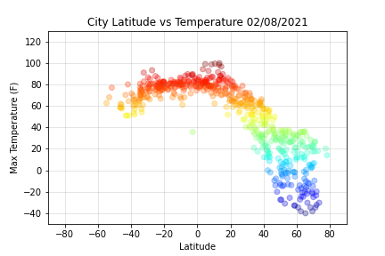
Temperature vs. Latitude is generally showing that the maximum temperatures are the highest closest to the equator (0). The farther north, the maximum temperatures get colder.

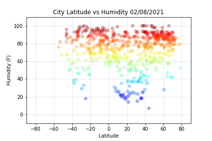
Humidity vs. Latitude is generally showing that humidity levels (100% or less) greatly vary across the globe, though higher humidity levels are the majority (greater than 60%), especially in the latitudes between 30 and 70. The northern hemisphere tends to be more humid than the southern.

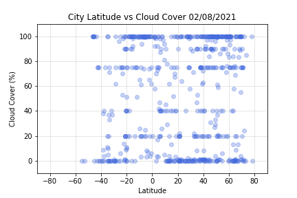
Cloud Cover vs. Latitude (cloudiness) is generally showing no relationship between cloud cover and location.

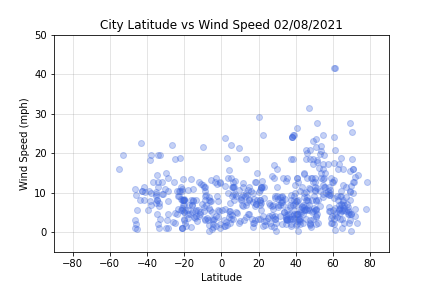
Wind Speed  vs. Latitude is generally showing no relationship between wind speed and location.

 
 

Linear regression on each relationship for the northern and summer hemispheres were performed. The northern hemisphere was defined as greater than or equal to 0 degrees latitude, and southern hemisphere was defined asless than 0 degrees latitude.

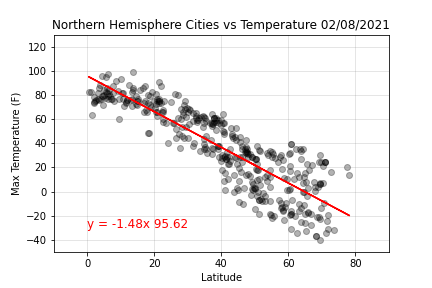
Northern Hemisphere: Temperature vs. Latitude regression is showing the closer to the equator the warmer the temperature. The r-squared value of 0.78, this is the highest of the coefficients of determination (closest to 1).

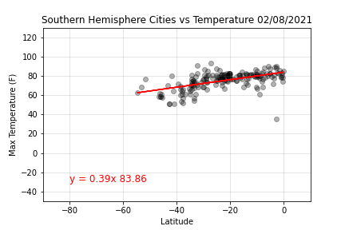
Southern Hemisphere: Temperature vs. Latitude regression is not showing as strong of a relationship between temperature and location as in the northern hemisphere. The r-squared value is 0.35.

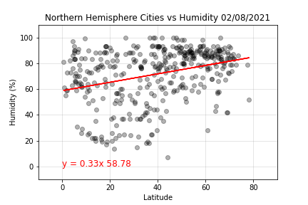
Northern Hemisphere: Humidity vs. Latitude regression is not showing a strong relationship between location and humidity levels. The r-squared value is 0.10.

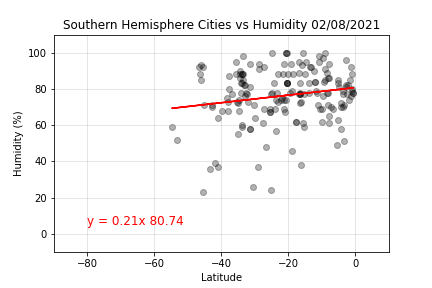
Southern Hemisphere: Humidity vs. Latitude regression, like for the northern hemisphere, is not showing a strong relationship. The r-squared value is 0.02.

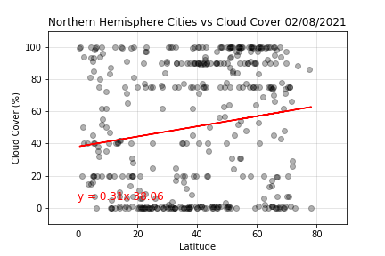
Northern Hemisphere: Cloud Cover (cloudiness) vs. Latitude regression is not showing a strong relationship between location and cloud cover. The r-squared value is 0.03.

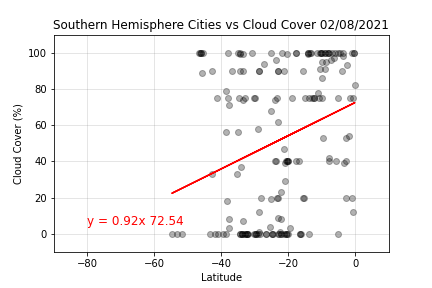
Southern Hemisphere: Cloud Cover (cloudiness) vs. Latitude regression is not showing a strong relationship between location and cloud cover. The r-squared value is 0.13.

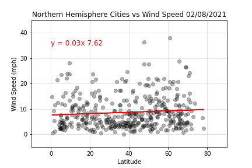
Northern Hemisphere: Wind Speed vs. Latitude regression is not showing a strong relationship between location and wind speed. The r-squared value is 0.008.

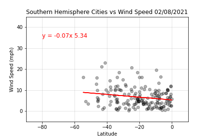
Southern Hemisphere: Wind Speed vs. Latitude regression is not showing a strong relationship between location and wind speed. The r-squared value is 0.038.

 
 

# Part II - VacationPy

## Overview
With the data from Part I, ideal vacation locations were determined using jupyter maps and the Google Places API.

A heat map was generated for the 585 cities. 

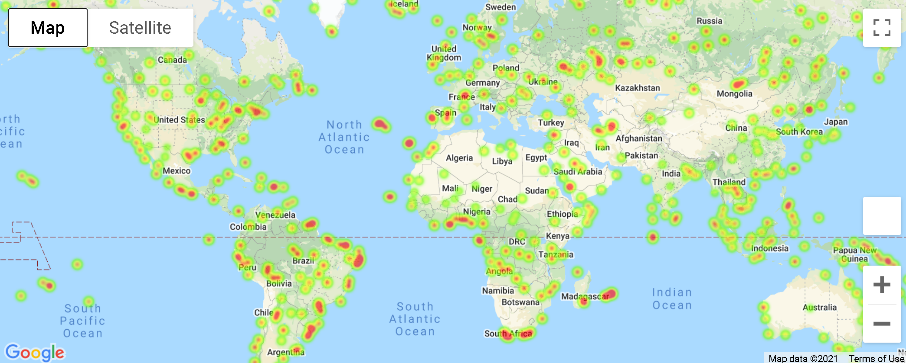

Data was reduced to include these ideal conditions:

  * A max temperature lower than 80 degrees but higher than 70.

  * Wind speed less than 10 mph.

  * Zero cloud cover (cloudiness).

With these conditions, Google Places API was used to find the first hotel for each of the 15 cities located within 5000 meters of the city location.

